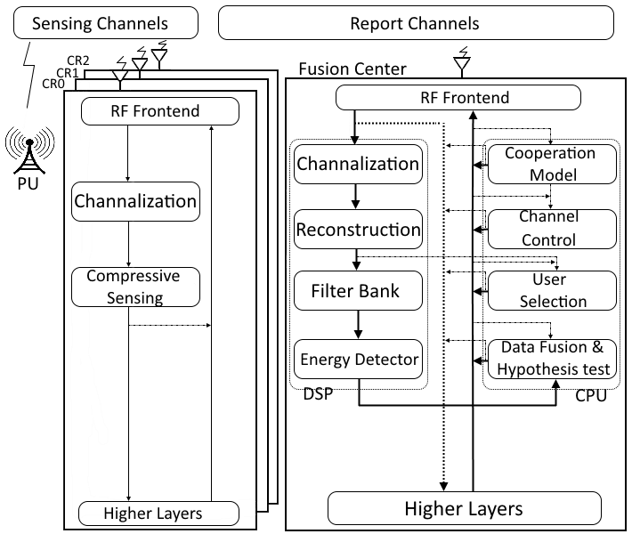
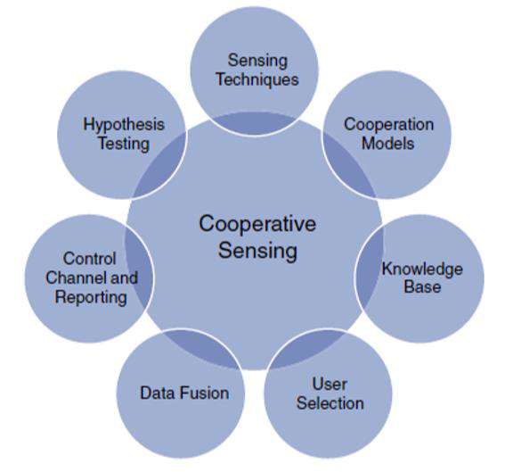

# Graduation_project-Cognitive_radio
SoC Based FPGA Implementation of A Complete Cognitive Cooperative Spectrum Sensing System//
Due to the repaid development in wireless technology, such as IoT WSN and 5 G, the demand for wireless
communication has increased and the current standard can’t fulfill this demand Cognitive radio ( is a promising
technology that improves the spectrum utilization efficacy CR is an intelligent network that has cognitive and
reconfigurable capabilities, therefore it’s can adapt itself to the changes in spectrum environment The main aspect of
CR is spectrum sensing In this project, a SoC based FPGA implementation of a complete high performance cooperative
spectrum sensing system is proposed Our system is divided to 5 Subsystems sensing, user selection, data fusion and
hypotheses testing, cooperation model and channel control and reporting Various schemes for cooperative spectrum
sensing are reviewed and the challenges associated with it, such as detection probability, false alarm probability,
cooperation overhead, power efficiency, sensing time and system security and complexity In this project we choose
the best schemes that optimally and practically solve this challenges
____________________________________________________________________________________

1//Sensing System ::The process of cooperative sensing starts with local spectrum sensing at each cooperating
CR user Energy and cyclostationary feature detection are the common detection techniques in cooperative spectrum
sensing, but Energy detection is the most popular sensing mechanism, Due to its simplicity and no requirements on a
priori knowledge of PU signal Compressed sensing enables the sampling of wide band signal at sub Nyquist rate to
relax ADC requirements and reduce control channel overhead based on the assumption that the signal is sparse in a
particular domain
•
Proposed Work Energy detection based compressive cooperative spectrum sensing algorithm is proposed In our
model we assume that there are N SUs and single FC as shown in Fig 1 every SU senses the wideband spectrum and
compresses the signal using Sparse Binary Sensing algorithm and reports it to FC At FC, all reported signals are jointly
recovered using Sparse Bayesian Learning (M SBL) algorithm, as all signals are correlated The reconstructed signals are
passed to filter bank then to energy detector which its output is passed to data fusion and hypothesis testing stage

________+++++++++_____________________________________
2//Data fusion and Hypothesis testing:: Data fusion is an important element in Cooperative sensing It
is a process of combining local sensing data for hypothesis testing There are three ways for combining, soft combining,
quantized soft combining and hard combining In Soft Combining, CR users can transmit the entire local sensing
samples or the complete local test statistics for soft decision It can achieve the best detection performance at FC, but
it increases the control channel overhead This problem can be solved using compressive sensing as show in sensing
section above
In
CSS, statistical hypothesis testing is typically performed to test the sensing results for the binary decision on the
presence of Pus
•
Proposed Work An optimal soft combining scheme is proposed in 1 based on NP Criterion to combine the local
observation The proposed scheme depends on SNR, however our contribution here is make this scheme depend on r
MSE instead as long as there is a link between r MSE and SNR as shown in user selection section above
In
hypothesis testing stage, Sensing time can be minimized by using the sequential probability ratio test (
developed by Wald 2 The main advantage of SPRT is that the same detection performance compared with binary
hypothesis test (such as Neyman Pearson test and Bayes test) or composite hypothesis test (Such as GLRP test), as it
requires fewer sampling on the average than those previous fixed sample testing methods In this method the FC
sequentially accumulates the log likelihood statistics from cooperating CR users and determines when to stop taking
more sequential observations and make a cooperative decision
_______________________________
3//User Selection:: The selection of CR users for cooperative sensing plays a key role in determining the
performance of cooperative sensing because it can be utilized to improve cooperative gain and address the overhead
issues
•
Proposed Work In cooperative sensing there are two important performance parameters, cooperative gain and
cooperative overhead These parameters can be improved by using a good user selection scheme In user selection FC
choose CRs with best environment to be cooperate The good environment is indicated by SNR Here as we choose
Compressive sensing, we can link SNR with relative Mean Square Error (r MSE) Zhang 3 proposes r MSE as indicator
______________________________________________________
4//Cooperation System
The Behavior and Cooperation of CR users for Cooperative Spectrum Sensing can be modeled by different approaches
The modeling in cooperative sensing is primarily concerned with how CR users cooperate to perform spectrum sensing
and achieve the optimal detection performance
•
Proposed Work Evolutionary Game is proposed to model the cooperation behavior of CRs our model assume
single FC and N heterogonous secondary user, where all CRs have different utility functions as they have different SNR
and different channel capacity Also, learning algorithm for Nash Equilibrium is also proposed, where the CRs can
gradually converges to Nash equilibrium
____________________________+++++++++++++++++++++++
5//Channel Control and Reporting:: A common control channel is commonly used by CRs in Cooperative Sensing to report the local sensing data, the control channel can be a dedicated channel in licensed or unlicensed band Three major control channel requirements must be satisfied in Cooperative Spectrum Sensing bandwidth, Reliability and security
•
Proposed Work In an actual reporting scenario, the number of available reporting channel is far smaller than the
CRs numbers So 4 proposes a reporting channel design based on Aloha random access protocol Our contribution
here is optimizing the SPRT hypothesis algorithm and User selection algorithm with Aloha protocol to reduce the
number of CRs and therefor reduce the transmission collision in the channel and increase the probability of detection

